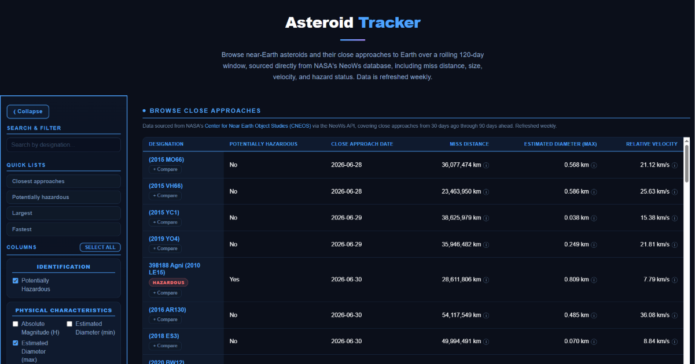
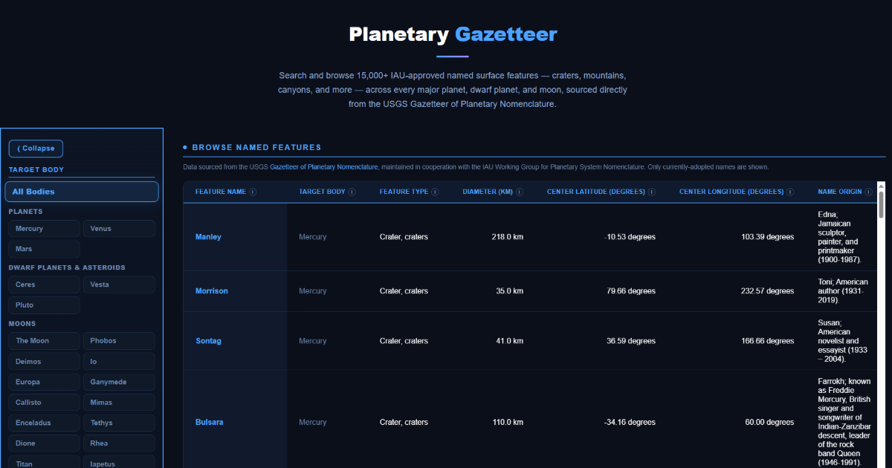
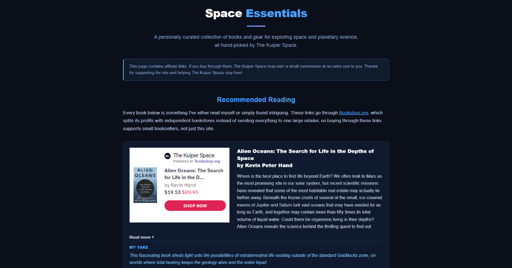

# The Kuiper Space

Interactive planetary and exoplanet science platform for exploring real astronomical data through hands-on tools, simulations, and visualizations.

🔗 **Live site:** [thekuiperspace.com](https://thekuiperspace.com)

---

## Overview

The Kuiper Space started as a small tool for comparing planets side by side and has grown into eight interactive tools — five spanning the solar system, plus three live-refreshed catalogs: thousands of confirmed exoplanets from NASA's Exoplanet Archive, hundreds of tracked near-Earth asteroid close approaches from NASA's NeoWs database, and 15,000+ IAU-approved named surface features from the USGS Gazetteer of Planetary Nomenclature. The site also includes Space Essentials, a curated page of externally-linked book and gear recommendations.

---

## Features

### Planetary Properties
Compares physical, orbital, and environmental characteristics across 26 solar system bodies — planets, moons, dwarf planets, and asteroids — with size-comparison visuals and side-by-side data tables.

<p align="center">
  
</p>

### Scenario Comparisons
Simulates real-world scenarios (body weight, jump height, throw distance, running speed) across different planetary gravitational environments, with animated visual comparisons and unit switching.

<p align="center">
  
</p>

### 3D Planet Viewer
Photorealistic, rotating 8K 3D models of every planet, the Sun, and the Moon, built with Three.js. Supports drag-to-rotate, scroll-to-zoom, a realistic-scale toggle, and day/night shadows.

<p align="center">
  
</p>

### Orbit Simulator
Accelerated Canvas-based animation of inner, full, and outer solar system orbits at accurate relative speeds, with adjustable playback speed.

<p align="center">
  
</p>

### Unit Conversions
200+ conversions across length, mass, time, speed, energy, power, temperature, and more, with a searchable interface.

<p align="center">
  
</p>

### Exoplanet Explorer
Searches and compares 6,000+ confirmed exoplanets pulled directly from NASA's Exoplanet Archive (Planetary Systems Composite Parameters table). Supports sorting, a configurable column picker across physical/orbital/host-star categories, measurement-uncertainty display, and side-by-side comparison against Earth as a fixed reference point. Data refreshes automatically on a weekly schedule — see [Data Automation](#data-automation) below.

<p align="center">
  
</p>

### Asteroid Tracker
Browses near-Earth asteroid close approaches over a rolling 120-day window (30 days past, 90 days ahead), sourced directly from NASA's NeoWs (Near Earth Object Web Service). Supports sorting, a configurable column picker, potentially-hazardous flagging, curated quick lists (closest, largest, fastest, hazardous), and side-by-side comparison. Data refreshes automatically on a weekly schedule — see [Data Automation](#data-automation) below.

<p align="center">
  
</p>

### Planetary Gazetteer
Searches and browses 15,000+ IAU-approved named surface features — craters, mountains, canyons, and more — across 27 planets, dwarf planets, and moons, sourced directly from the USGS Gazetteer of Planetary Nomenclature. Browse by a specific target body or across all bodies at once, filter by feature type, and use curated quick lists (largest features, recently approved). Includes a feature-type glossary explaining descriptor terms (crater, mons, chasma, patera, and others) with a real example for each. Data refreshes automatically on a weekly schedule — see [Data Automation](#data-automation) below.

<p align="center">
  
</p>

### Space Essentials
A personally curated collection of space and planetary science books (via Bookshop.org, which supports independent bookstores) and eclipse-viewing gear (via Eclipse Glasses / American Paper Optics, ISO 12312-2 certified). Unlike the tools above, this isn't backed by a data pipeline — it's hand-maintained affiliate content, with clear disclosure at the top of the page.

<p align="center">
  
</p>

---

## Tech Stack

- **Frontend:** Vanilla JavaScript (ES6+), HTML5, CSS3 — no framework
- **Visualization:** Canvas API (2D scale/orbit rendering), Three.js r165 (3D planet viewer)
- **Data:** JSON-based, config-driven architecture — a single schema file per catalog drives table columns, units, and tooltips
- **External data sources:** [NASA Exoplanet Archive](https://exoplanetarchive.ipac.caltech.edu/) via its TAP/ADQL query service, [NASA NeoWs](https://api.nasa.gov/) for near-Earth asteroid data, and the [USGS Gazetteer of Planetary Nomenclature](https://planetarynames.wr.usgs.gov/) via per-target GIS shapefile downloads
- **GIS/shapefile parsing:** `shapefile` and `adm-zip` npm packages (used only by the Gazetteer fetch script — every other fetch script is dependency-free, using Node's built-in `fetch`)
- **Affiliate integrations:** [Bookshop.org](https://bookshop.org/) embeddable widgets and [Eclipse Glasses](https://www.eclipseglasses.com/) affiliate links, both used on the Space Essentials page — these are commercial partner integrations, not scientific data sources
- **Automation:** Node.js fetch scripts, scheduled weekly via a single combined GitHub Actions workflow
- **Hosting/Deployment:** Netlify, with custom redirect rules (clean, extensionless URLs)
- **SEO:** JSON-LD structured data, XML sitemap, Open Graph/Twitter meta tags
- **Shared UI:** A single `site-chrome.js` file injects the nav bar and footer across every page, rather than duplicating that markup per file

---

## Data Automation

`scripts/fetch-exoplanet-data.js` pulls the current confirmed-planet dataset from NASA's Exoplanet Archive and writes it to `data/exoplanets.json`. `scripts/fetch-asteroid-data.js` pulls near-Earth asteroid close-approach data from NASA's NeoWs feed endpoint (chunked into 7-day requests, NeoWs's per-request limit) and writes it to `data/asteroids.json`. `scripts/fetch-gazetteer-data.js` downloads per-target GIS shapefiles from USGS (regenerated nightly on their end), parses them with the `shapefile` package, and writes the combined result to `data/gazetteer.json`.

All three run automatically once a week via the single combined GitHub Actions workflow in `.github/workflows/refresh-catalog-data.yml`, which commits all three files together in one push. This keeps the cost to one Netlify deployment per week covering every catalog, rather than a separate deployment per catalog.

To run any of them manually:
```
node scripts/fetch-exoplanet-data.js
NASA_API_KEY=your_key_here node scripts/fetch-asteroid-data.js
npm install shapefile adm-zip
node scripts/fetch-gazetteer-data.js
```
Requires Node 18+ (uses the built-in `fetch`). The asteroid script requires a free API key from [api.nasa.gov](https://api.nasa.gov). The exoplanet script does not require an API key. The gazetteer script requires its two npm dependencies to be installed first (shown above) — it's the only fetch script on this project with any external dependencies. To test the gazetteer script against a single body instead of the full ~27-body run, set `GAZETTEER_TARGET` (e.g. `GAZETTEER_TARGET=IO node scripts/fetch-gazetteer-data.js`).

---

## Project Status

Live and actively maintained, with real organic traffic and ongoing feature work — no longer an early-stage prototype.

---

## Running Locally

Opening `index.html` directly, or using a basic static server (e.g., VS Code's Live Server), works for viewing individual pages, but **won't accurately reflect production behavior** — specifically, it can't simulate the Netlify redirect rules that power the clean URLs. For a faithful local preview, use the [Netlify CLI](https://docs.netlify.com/cli/get-started/):
```
netlify dev
```

---

## A Note on Data

Astronomical data displayed by this project (solar system data via NASA JPL, exoplanet data via NASA's Exoplanet Archive, near-Earth asteroid data via NASA's NeoWs, named surface feature data via the USGS Gazetteer of Planetary Nomenclature) is sourced from public NASA and USGS resources and is not covered by this project's own license below — it belongs to its original source and is used here for educational purposes with attribution.

Product information and imagery on the Space Essentials page (books via Bookshop.org, eclipse-viewing gear via Eclipse Glasses / American Paper Optics) belongs to those respective merchants and is used under their affiliate programs' own terms, for the purpose of promoting their products through this site's affiliate links.

---

## License

This project is licensed under Creative Commons Attribution-NonCommercial 4.0 International (CC BY-NC 4.0). See [LICENSE](./LICENSE) for details.

---

## Author

Built by Derek Tobias — physics and astronomy graduate, Brigham Young University. [linkedin.com/in/derek-tobias](https://linkedin.com/in/derek-tobias)