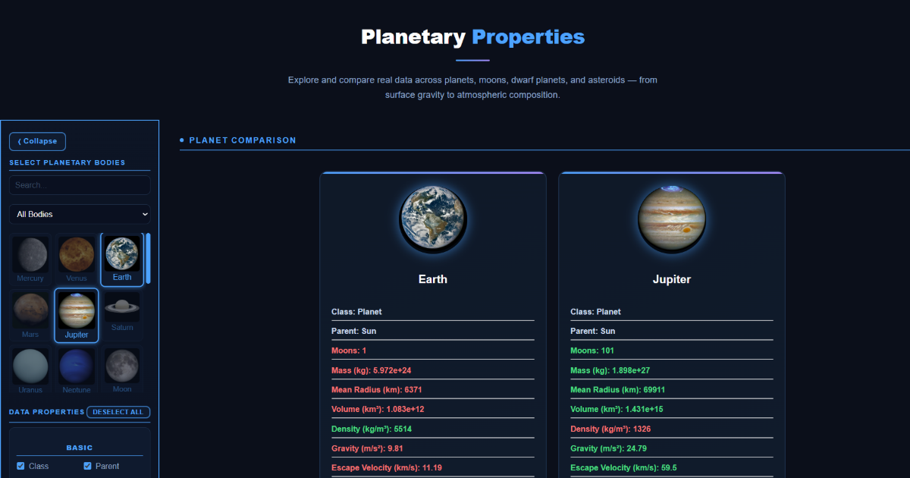
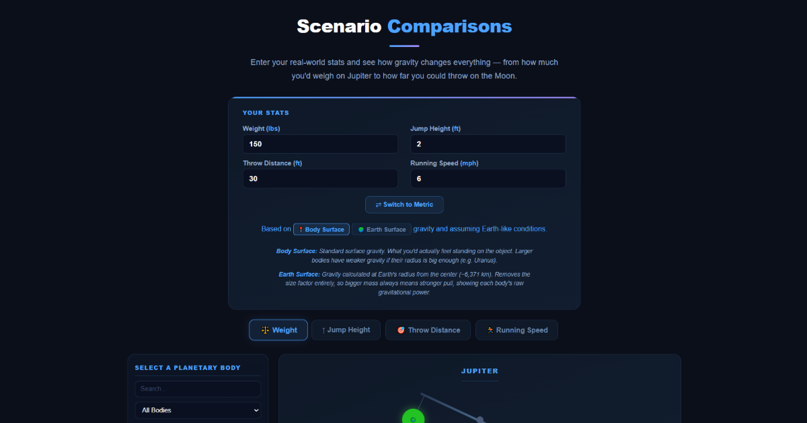
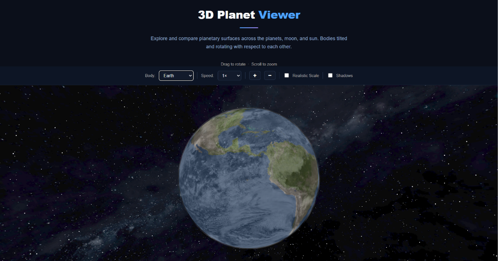
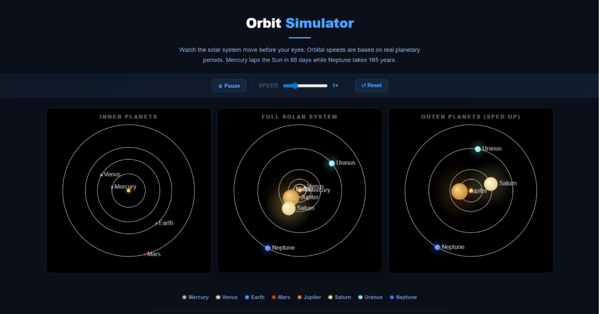
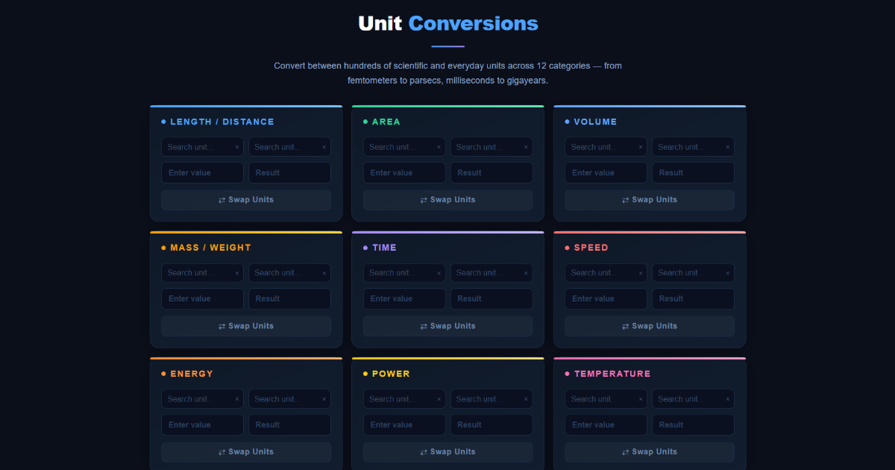
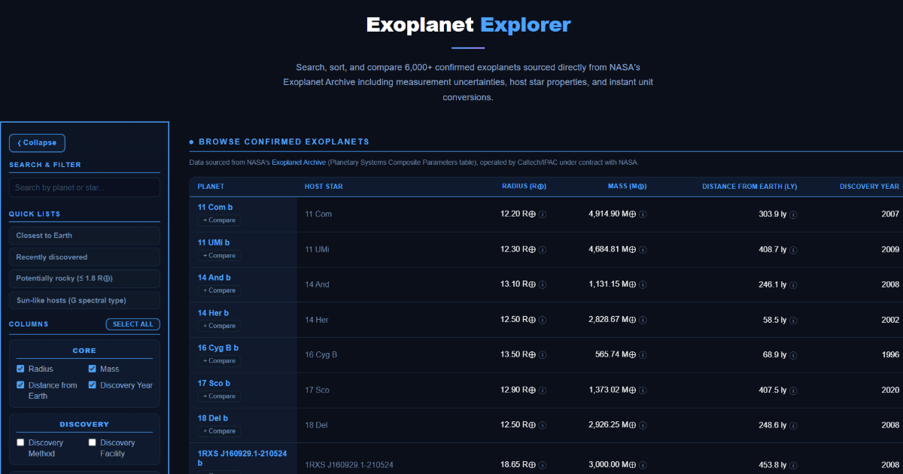

# The Kuiper Space

Interactive planetary and exoplanet science platform for exploring real astronomical data through hands-on tools, simulations, and visualizations.

🔗 **Live site:** [thekuiperspace.com](https://thekuiperspace.com)

---

## Overview

The Kuiper Space started as a small tool for comparing planets side by side and has grown into a set of six interactive tools spanning the solar system and, more recently, a searchable database of thousands of confirmed exoplanets sourced directly from NASA's Exoplanet Archive.

---

## Features

### Planetary Properties
Compares physical, orbital, and environmental characteristics across 26 solar system bodies — planets, moons, dwarf planets, and asteroids — with size-comparison visuals and side-by-side data tables.

<p align="center">
  
</p>

### Scenario Comparisons
Simulates real-world scenarios (body weight, jump height, throw distance, running speed) across different planetary gravitational environments, with animated visual comparisons and unit switching.

<p align="center">
  
</p>

### 3D Planet Viewer
Photorealistic, rotating 8K 3D models of every planet, the Sun, and the Moon, built with Three.js. Supports drag-to-rotate, scroll-to-zoom, a realistic-scale toggle, and day/night shadows.

<p align="center">
  
</p>

### Orbit Simulator
Accelerated Canvas-based animation of inner, full, and outer solar system orbits at accurate relative speeds, with adjustable playback speed.

<p align="center">
  
</p>

### Unit Conversions
200+ conversions across length, mass, time, speed, energy, power, temperature, and more, with a searchable interface.

<p align="center">
  
</p>

### Exoplanet Explorer
Searches and compares 6,000+ confirmed exoplanets pulled directly from NASA's Exoplanet Archive (Planetary Systems Composite Parameters table). Supports sorting, a configurable column picker across physical/orbital/host-star categories, measurement-uncertainty display, and side-by-side comparison against Earth as a fixed reference point. Data refreshes automatically on a weekly schedule — see [Data Automation](#data-automation) below.

<p align="center">
  
</p>

---

## Tech Stack

- **Frontend:** Vanilla JavaScript (ES6+), HTML5, CSS3 — no framework
- **Visualization:** Canvas API (2D scale/orbit rendering), Three.js r165 (3D planet viewer)
- **Data:** JSON-based, config-driven architecture — a single schema file drives table columns, units, and tooltips across tools
- **External data source:** [NASA Exoplanet Archive](https://exoplanetarchive.ipac.caltech.edu/) via its TAP/ADQL query service
- **Automation:** Node.js fetch script, scheduled weekly via GitHub Actions
- **Hosting/Deployment:** Netlify, with custom redirect rules (clean, extensionless URLs)
- **SEO:** JSON-LD structured data, XML sitemap, Open Graph/Twitter meta tags
- **Shared UI:** A single `site-chrome.js` file injects the nav bar and footer across every page, rather than duplicating that markup per file

---

## Data Automation

`scripts/fetch-exoplanet-data.js` pulls the current confirmed-planet dataset from NASA's Exoplanet Archive and writes it to `data/exoplanets.json`. This runs automatically once a week via the GitHub Actions workflow in `.github/workflows/refresh-exoplanet-data.yml`, which commits the refreshed file only if the data actually changed.

To run it manually:
```
node scripts/fetch-exoplanet-data.js
```
Requires Node 18+ (uses the built-in `fetch`).

---

## Project Status

Live and actively maintained, with real organic traffic and ongoing feature work — no longer an early-stage prototype.

---

## Running Locally

Opening `index.html` directly, or using a basic static server (e.g., VS Code's Live Server), works for viewing individual pages, but **won't accurately reflect production behavior** — specifically, it can't simulate the Netlify redirect rules that power the clean URLs. For a faithful local preview, use the [Netlify CLI](https://docs.netlify.com/cli/get-started/):
```
netlify dev
```

---

## A Note on Data

Astronomical data displayed by this project (solar system data via NASA JPL, exoplanet data via NASA's Exoplanet Archive) is sourced from public NASA resources and is not covered by this project's own license below — it belongs to its original source and is used here for educational purposes with attribution.

---

## License

This project is licensed under Creative Commons Attribution-NonCommercial 4.0 International (CC BY-NC 4.0). See [LICENSE](./LICENSE) for details.

---

## Author

Built by Derek Tobias — physics and astronomy graduate, Brigham Young University. [linkedin.com/in/derektobias](https://linkedin.com/in/derektobias)